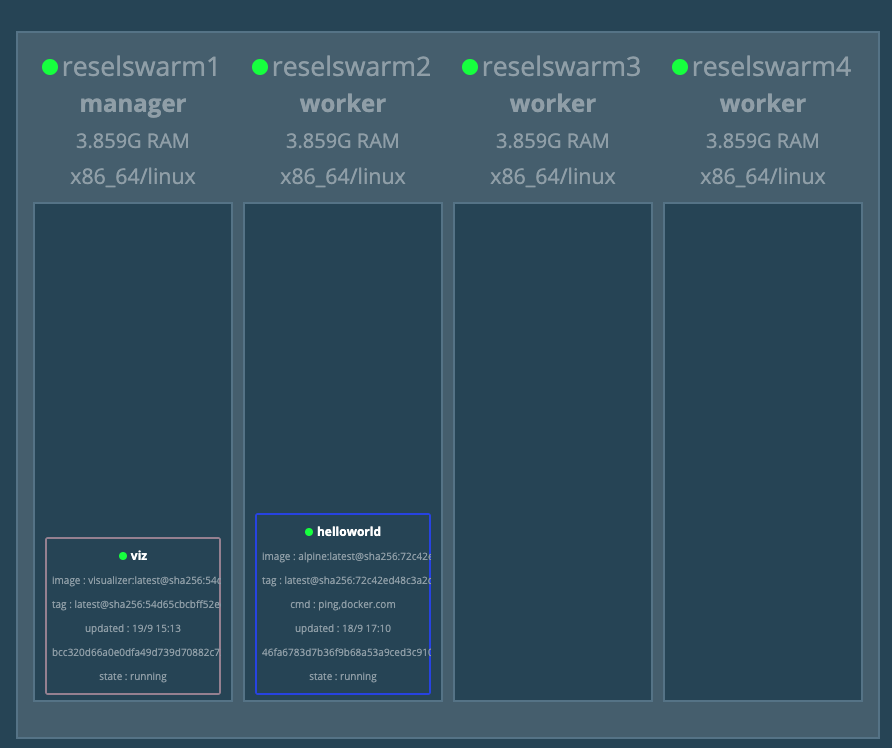

# Swarm

The purpose of this project is to demonstrate how to set up Docker Swarm on a set of 4 virtual machines that were created using Vagrant. You can find
the Vagrantfile used to create the 4 VMs [here](Vagrantfile).

The process described here is valid should you have standalone virtual machines on AWS or Google Cloud, for instance,
that can access using standard [`ssh`](https://www.ssh.com/ssh/command/).

**Step 1:** `ssh` into the first virtual machine. This machine will be the Docker Swarm master. The names of the virtual machines
within the scope of this demo is `reselswarmX`, where `X` is a numeral.

`sudo vagrant ssh reselswarm1`

**Step 2:** Run `docker swarm init`. 

`sudo docker swarm init --advertise-addr 192.168.86.224`

**WHERE**

* `--advertise-addr` is the address other nodes in the Docker swarm use to connect into your node. You need to provide an IP address of your host, or a network
interface which Docker will use to lookup your IP address, and a port number which defaults to 2377.
* `192.168.86.224` is the address of the particular virtual machine, `reselswarm1`

When you run `init` you will be given an `join` clause that you'll use to have other virtual machines join the swarm as worker nodes. The output
will be look like something similar to the following:

`docker swarm join --token SWMTKN-1-34155k9gn764e6f9xbl9pma9mzhoeogv2oepu7p62tvud8ixcf-1dzucrxt8uyuo83owe19awbt0 192.168.86.224:2377`

**Step 3:** Exit the first VM.

`exit`

**Step 4:** `ssh` into the second virtual machine. This machine will be a Docker Swarm node.

`sudo vagrant ssh reselswarm2`

**Step 5:** Execute the following command to have the VM join the swarm...

`sudo docker swarm join --token SWMTKN-1-34155k9gn764e6f9xbl9pma9mzhoeogv2oepu7p62tvud8ixcf-1dzucrxt8uyuo83owe19awbt0 192.168.86.224:2377`

... then exit the VM.

`exit`

**Step 6:** `ssh` into the third virtual machine. This machine will be a Docker Swarm node.

`sudo vagrant ssh reselswarm3`

**Step 7:** Execute the following command to have the VM join the swarm...

`sudo docker swarm join --token SWMTKN-1-34155k9gn764e6f9xbl9pma9mzhoeogv2oepu7p62tvud8ixcf-1dzucrxt8uyuo83owe19awbt0 192.168.86.224:2377`

... then exit the VM.

`exit`

**Step 8:** `ssh` into the forth virtual machine. This machine will be a Docker Swarm node.

`sudo vagrant ssh reselswarm4`

**Step 9** Execute the following command to have the VM join the swarm...

`sudo docker swarm join --token SWMTKN-1-34155k9gn764e6f9xbl9pma9mzhoeogv2oepu7p62tvud8ixcf-1dzucrxt8uyuo83owe19awbt0 192.168.86.224:2377`

... then exit the VM.

`exit`

**Step 10:**  Now, let's get a list of all the nodes in the Swarm we've just created. `ssh` back into the first virtual manager, which is the Docker Swarm Manager.

`sudo vagrant ssh reselswarm1`
 
**Step 11:** Run the following command on the Docker Swarm Manager to get the list of nodes:
 
`docker node ls`
 
You'll get output similar to the following:
 
```text
ID                            HOSTNAME            STATUS              AVAILABILITY        MANAGER STATUS      ENGINE VERSION
08xu0u50s0vz46c4f2usic9sm *   reselswarm1         Ready               Active              Leader              18.09.7
hk45nwvexvem0zb6pg8w9igb7     reselswarm2         Ready               Active                                  18.09.7
toelhe1rvar79tq9uk9e88kja     reselswarm3         Ready               Active                                  18.09.7
xjy2ni9kgc7crfexhehwc92kz     reselswarm4         Ready               Active                                  18.09.7
```

**Step 13"** Let's create a simple service on the Swarm.

`docker service create --replicas 1 --name helloworld alpine ping docker.com`


**Step 12:** Now let's install the [Docker Swarm Visualizer](https://github.com/dockersamples/docker-swarm-visualizer).
The Visualizer is a utility that allows you view information about the swarm in a graphical manner.

On this first virtual machine which is the Docker Swarm Manager, execute the following command:

```text
sudo docker service create \
  --name=viz \
  --publish=8080:8080/tcp \
  --constraint=node.role==manager \
  --mount=type=bind,src=/var/run/docker.sock,dst=/var/run/docker.sock \
  dockersamples/visualizer
```

**Step 13:** Go to your browser and in the address bar, execute the following command

`http://192.168.86.224:8080/`

**WHERE**

* `192.168.86.224` is the pubic IP address of the Docker Swarm Manager virtual machine
* `8080` is the port on which the Docker Swarm Visualizer is running.

You'll see a web page similar to the following.


