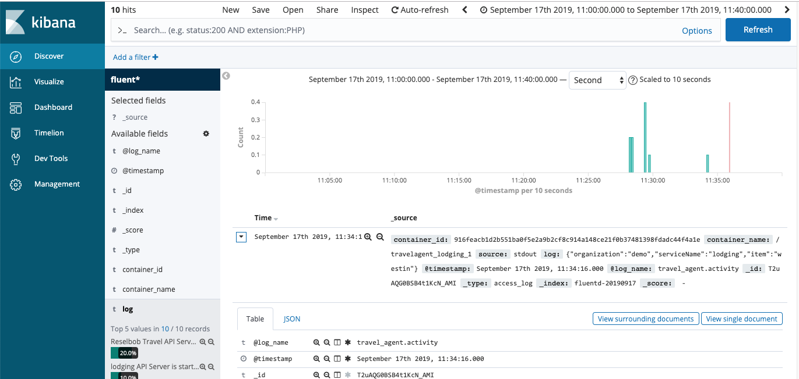

# Travel Agent

The purpose of this project is to demonstrate how to incorporate an ELK stack created using Docker Compose into another Docker Compose application.

The application we'll in corporate is Travel Agent. Travel agent is an HTTP url that returns a travel service at random.

After Travel Agent is brought up using Docker Compose, the application will be accessible on port 4000. (Assuming you use all the default
settings.)

## General Example

`curl localhost:4000`

Will return a response similar to:

`{"serviceName":"lodging","item":"westin","agent":"Reselbob Travel"}`

**WHERE**

* `serviceName`, is one of the subordinate applications that provides service to the Travel Agency (`auto`, `airline`, `travel`).
* `item`, is one of the items that `serviceName` provides
* `agent`, is the travel agent coordinating all activity

## Getting Up and Running

Getting Travel Agent up and running is a 2 stage process. First, you'll need to get the Docker Compose  ELK Stack started.
Then you'll need to get the actual Travel Agent application running under Docker Compose.

### Get the Elk Stack Up and Running

**Step 1:** Navigate to the directory, `elk`.

`cd elk`

**Step 2:** Start the ELK Stack using `docker-compose`

`docker-compose up`

It will take a while for the entire stack to load in. Once loaded, you'll be able to view the Kibana UI at `localhost:5601`

### Get the Travel Agent Service Up and Running

**Step 1** : In a **new** terminal window, navigate back to the `travelagent` directory. Make sure you can see the file,
`docker-compose.yaml`.

`cat docker-compose.yaml`

You'set output similar to the following

```yaml
version: '3'
services:
  agent:
    build: ./agent
    ports:
      - "4000:3000"
    logging:
      driver: "fluentd"
      options:
        fluentd-address: localhost:24224
        tag: travel_agent.activity
    networks:
      - reselbob_travel
  auto:
    build: ./app
    environment:
      APP_NAME: auto
      APP_ITEMS: ford:fiat:bmw
    logging:
      driver: "fluentd"
      options:
        fluentd-address: localhost:24224
        tag: travel_agent.activity
    networks:
      - reselbob_travel
  lodging:
    build: ./app
    logging:
      driver: "fluentd"
      options:
        fluentd-address: localhost:24224
        tag: travel_agent.activity
    environment:
      APP_NAME: lodging
      APP_ITEMS: hilton:westin:motel6
    networks:
      - reselbob_travel
  airline:
    build: ./app
    environment:
      APP_NAME: airline
      APP_ITEMS: virgin:jetblue:delta
    logging:
      driver: "fluentd"
      options:
        fluentd-address: localhost:24224
        tag: travel_agent.activity
    networks:
      - reselbob_travel
networks:
  reselbob_travel:
```

**Step 2** Start the Travel Agent service using Docker Compose.

`docker-compose up`

When the process completes, you'll see output similar to the following:

```text
Creating network "travelagent_reselbob_travel" with the default driver
Creating travelagent_lodging_1 ...
Creating travelagent_auto_1
Creating travelagent_airline_1
Creating travelagent_agent_1 ... done
```

**Step 3** Let's get the Travel Agent to generate some data.
(Again, we're assuming you're running everything using the settings described in `docker-compose.yaml`.)

In a third terminal window, type the following:

`curl localhost:4000`


You'get response will have randome values, but the fields will be similar to the following:

`{"serviceName":"airline","item":"delta","agent":"Reselbob Travel"}`

**Step 4** Take a look at the Kibana UI at `locahost:5601` in your browser. You should see something similar to the following:

