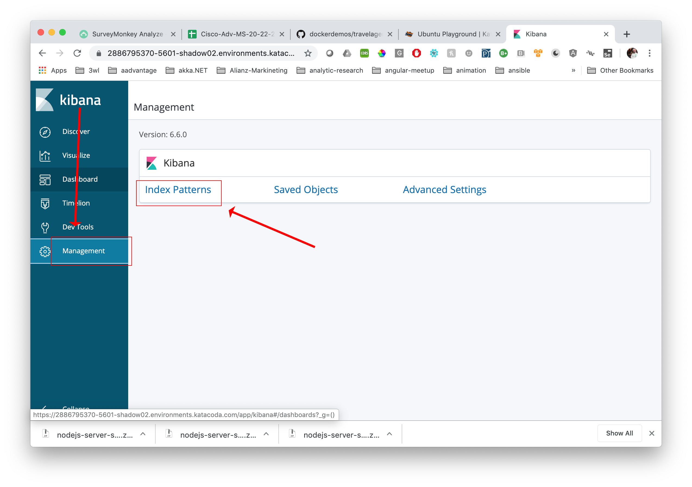

# Travel Agent

The purpose of this project is to demonstrate how to incorporate an EFK ([Elasticsearch](https://www.elastic.co/products/elasticsearch),
[FluentD](https://www.fluentd.org/), [Kibana](https://www.elastic.co/products/kibana)) stack created using Docker Compose into another Docker Compose application.

The application we'll incorporate is Travel Agent. Travel Agent service is represented as an HTTP url that returns fictitious travel service information at random.

After Travel Agent is brought up using Docker Compose, the application will be accessible on port 4000. (Assuming you use all the default
settings.)

## Pre-installation

In this project we'll use the Katacoda Ubuntu Playground virtual machine as our runtime environment.

**Step 1:** Go to the Katacoda Ubuntu Playground

`https://katacoda.com/courses/ubuntu/playground`

**Step 2:** Clone the GitHub respository that contains the project's source code.

`git clone https://github.com/reselbob/dockerdemos.git`

**Step 3:** Navigate to the project directory;

`cd dockerdemos/travelagent/`

## Getting the EFK Up and Running

Getting Travel Agent up and running is a 2 stage process. First, you'll need to get the Docker Compose  EFK stack started.
Then you'll need to get the actual Travel Agent application running under Docker Compose.

### Get the EFK Stack Up and Running

**Step 1:** Navigate to the directory, `efk`.

`cd efk`

**Step 2:** Start the EFK Stack using `docker-compose`

`docker-compose up`

It will take a while for the entire stack to load in. Once loaded, you'll be able to view the Kibana UI at `localhost:5601`

### Get the Travel Agent Service Up and Running

**Step 1** : In a **new** terminal window, navigate back to the `travelagent` directory.

`cd dockerdemos/travelagent/`

Make sure you can see the file, `docker-compose.yaml`.

`cat docker-compose.yaml`

You'set output similar to the following.

```yaml
version: '3'
services:
  agent:
    build: ./agent
    ports:
      - "4000:3000"
    logging:
      driver: "fluentd"
      options:
        fluentd-address: localhost:24224
        tag: travel_agent.activity
    networks:
      - reselbob_travel
  auto:
    build: ./app
    environment:
      APP_NAME: auto
      APP_ITEMS: ford:fiat:bmw
    logging:
      driver: "fluentd"
      options:
        fluentd-address: localhost:24224
        tag: travel_agent.activity
    networks:
      - reselbob_travel
  lodging:
    build: ./app
    logging:
      driver: "fluentd"
      options:
        fluentd-address: localhost:24224
        tag: travel_agent.activity
    environment:
      APP_NAME: lodging
      APP_ITEMS: hilton:westin:motel6
    networks:
      - reselbob_travel
  airline:
    build: ./app
    environment:
      APP_NAME: airline
      APP_ITEMS: virgin:jetblue:delta
    logging:
      driver: "fluentd"
      options:
        fluentd-address: localhost:24224
        tag: travel_agent.activity
    networks:
      - reselbob_travel
networks:
  reselbob_travel:
```
Review the file, `docker-compose.yaml` to get a sense of the various services that make up the `Travel Agent` application.

**Step 2** Start the Travel Agent service using Docker Compose.

`docker-compose up`

When the process completes, you'll see output similar to the following:

```text
Creating network "travelagent_reselbob_travel" with the default driver
Creating travelagent_lodging_1 ...
Creating travelagent_auto_1
Creating travelagent_airline_1
Creating travelagent_agent_1 ... done
```

**Step 3** Let's get the Travel Agent to generate some data.
(Again, we're assuming you're running everything using the settings described in `docker-compose.yaml`.)

In a **third terminal window**, type the following:

`curl localhost:4000`

You'get response will have random values, but the fields will be similar to the following:

`{"serviceName":"airline","item":"delta","agent":"Reselbob Travel"}`

Now, let's make it so that the travel agent is always calling services:

`while [ 1 -eq 1 ]; do curl localhost:4000; done`

The code above will run forever or until you shut down Katacoda session.
### Viewing the Kibana Dashboard Under Katacoda

**Step 1:** in the Katacoda Interactive Learning environment, click the plus (+) character at
the right of the menu bar.


**Step 2:** Select the option, `Select port to view on Host 1`, from the dropdown menu.


**Step 3:** Enter the Kibana port, `5601` in the Web Preview Port Selector web page that appears.


After you've entered the port number in textbox, click the button, `Display Port`.

**Step 4:** After a few seconds the web page, `Welcome to Kibana` will appear.





**Step 5:** After you complete the Kibana initialization process, you'll see
Travel Agent activity in the Kibana Dashboard. 


**Congatulations!** Hopefully the Demo Gods are with you and all went well.